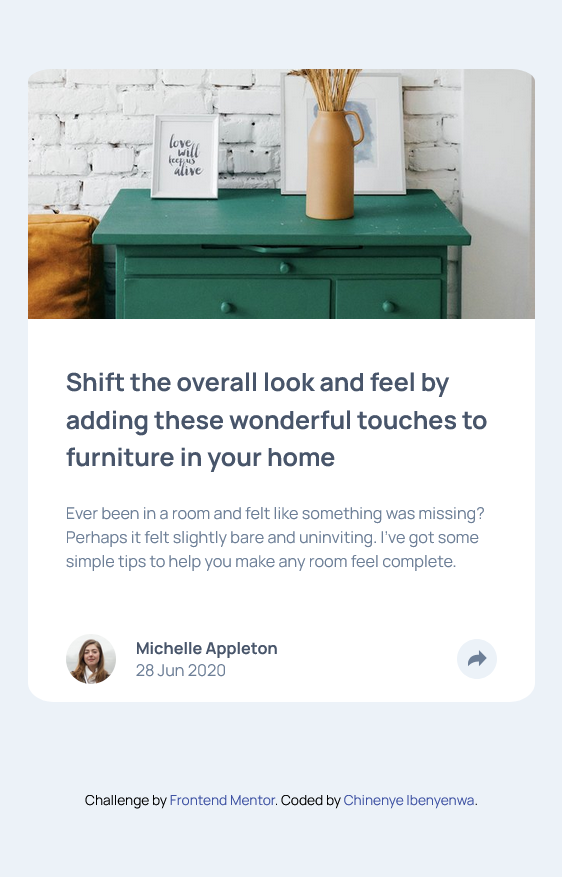
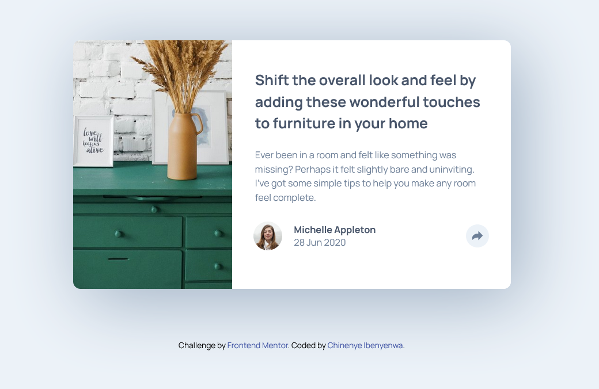
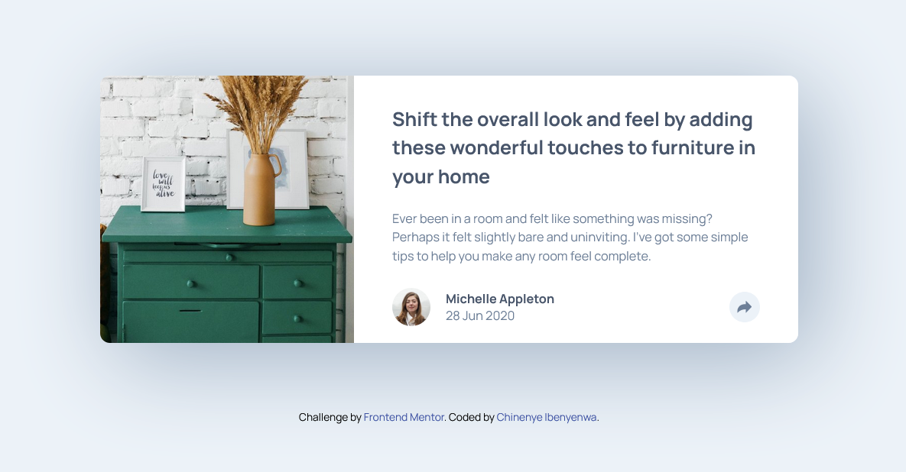
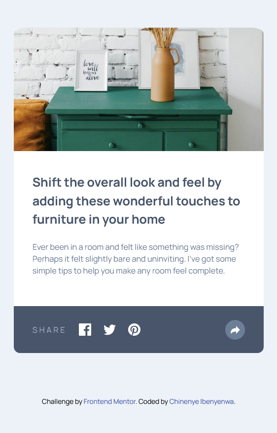
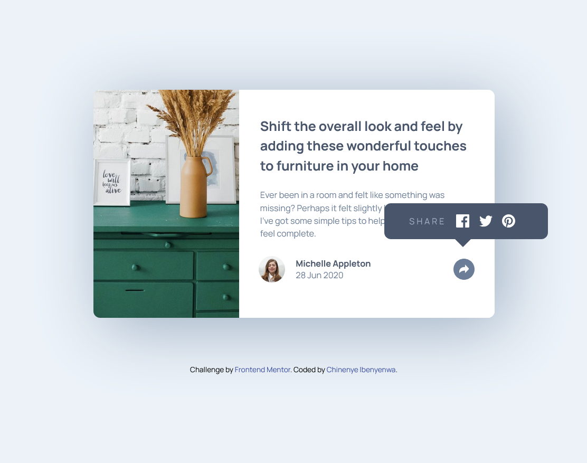
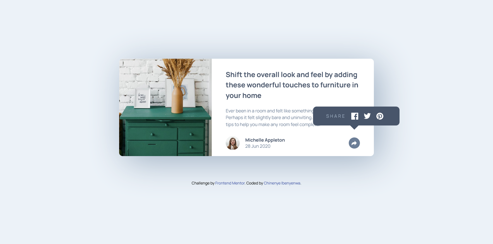

# Frontend Mentor - Article preview component solution

This is a solution to the [Article preview component challenge on Frontend Mentor](https://www.frontendmentor.io/challenges/article-preview-component-dYBN_pYFT). Frontend Mentor challenges help you improve your coding skills by building realistic projects. 

## Table of contents

- [Overview](#overview)
  - [The challenge](#the-challenge)
  - [Screenshots](#screenshots)
  - [Links](#links)
  - [Built with](#built-with)
  - [What I learned](#what-i-learned)
  - [Useful resources](#useful-resources)
- [Author](#author)


## Overview

### The challenge

Users should be able to:

- View the optimal layout for the component depending on their device's screen size
- See the social media share links when they click the share icon

### Screenshots







#### Active Views








### Links

- Solution URL: [Add solution URL here](https://your-solution-url.com)
- Live Site URL: [GitHub URL](https://charley95.github.io/article-preview-component/)


### Built with

- Semantic HTML5 markup
- CSS custom properties
- Flexbox
- Mobile-first workflow
- JavaScript


### What I learned

I learned different ways of working with svg icons and images.

See below the html and css code snippets for the svg:

```html
<svg class="share" xmlns="http://www.w3.org/2000/svg" width="15" height="13"><path fill="currentColor" d="M15 6.495L8.766.014V3.88H7.441C3.33 3.88 0 7.039 0 10.936v2.049l.589-.612C2.59 10.294 5.422 9.11 8.39 9.11h.375v3.867L15 6.495z"/>
</svg>
          
```
```css
.share {
    color: hsl(214, 17%, 51%);
 }
```
### Useful resources

- [W3schools](https://www.example.com) - This has always been my first reference point anytime I get stuck with a problem. I really liked it and will use it going forward.
- [Stack overflow](https://www.example.com) - This is an amazing community which helped me finally understand using svg icons and images. I'd recommend it to anyone still learning this concept.
- [YouTube]()


## Author

- Website - [Chinenye Ibenyenwa](https://charley95.github.io/portfolio-repo/)
- Frontend Mentor - [@Charley95](https://www.frontendmentor.io/profile/Charley95)
- LinkedIn - [Chinenye Ibenyenwa](https://www.linkedin.com/in/chinenye-ibenyenwa-9b667a168/)
